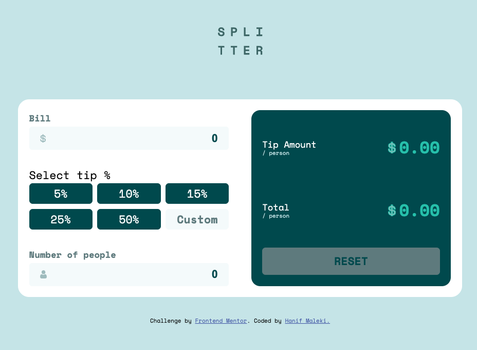

# Frontend Mentor - Tip calculator app solution

This is a solution to the [Tip calculator app challenge on Frontend Mentor](https://www.frontendmentor.io/challenges/tip-calculator-app-ugJNGbJUX). Frontend Mentor challenges help you improve your coding skills by building realistic projects.

## Table of contents

- [Overview](#overview)
  - [The challenge](#the-challenge)
  - [Screenshot](#screenshot)
  - [Links](#links)
- [My process](#my-process)
  - [Built with](#built-with)
  - [What I learned](#what-i-learned)
  - [Continued development](#continued-development)
- [Author](#author)

**Note: Delete this note and update the table of contents based on what sections you keep.**

## Overview

### The challenge

Users should be able to:

- View the optimal layout for the app depending on their device's screen size
- See hover states for all interactive elements on the page
- Calculate the correct tip and total cost of the bill per person

### Screenshot



### Links

- Solution URL: [Tip-Calculator](https://github.com/hanifmaleki/Tip-Calculator)
- Live Site URL: [Github Pages](https://hanifmaleki.github.io/Tip-Calculator/)

## My process

### Built with

- Semantic HTML5 markup
- CSS custom properties
- Flexbox
- CSS Grid
- Mobile-first workflow
- Pug template language
- Scss 
- Nvim
- Npm: watchs, copy-js

### What I learned
In this project, I used the Pug template language to make development more modular and maintainable. By breaking the interface into smaller Pug files and using mixins for reusable components like input fields, I was able to keep the structure clear and avoid repetitive code.

For styling, I used SCSS, which made the styles more organized and easier to maintain compared to plain CSS. Variables, nesting, and partials helped me keep the design consistent across the project.

I’m especially proud of creating reusable JavaScript classes for UI elements. For example, the InputNumber class encapsulates all behavior for a number input field, including focus/blur styling and error handling:

```pug
mixin inputSelectTipButton(id, value)
    .input-select-tip-button(id=id)= value + '%'

mixin inputNumber(id, label, inputId, errorText) 
    .input-input-container(id=id)
        .input-input-label-error-container
            label(for=id + '-input')= label
            .input-input-error-container
        .input-with-unit
            span.unit
                block
            input(id=id + '-input' type="number", value="0")
```
```scss
.input-select-tip-button {
    background-color: variables.$green-900;
    padding: 0.2em;
    border-radius: 0.3em;
    text-align: center;
    color: variables.$white;

    &.selected {
        background-color: variables.$green-400;
    }
}
```
```js
class InputNumber {
    constructor(element, changeListener) {
        this.element = element
        this.input = element.getElementsByTagName('input')[0]
        this.errorSpan = element.querySelector('.input-input-error-container')

        this.input.addEventListener('change', changeListener)
        this.input.addEventListener('focus', () => this.element.classList.add('focused'))
        this.input.addEventListener('blur', () => this.element.classList.remove('focused'))

    }

    get value() {
        return this.input.value
    }

    set value(value) {
        this.input.value = value
    }

    set errorText(text) {
        this.errorSpan.textContent = text
        this.element.classList.add('error')
    }

    clearError() {
        this.element.classList.remove('error')
    }
}
```

By encapsulating the logic in a class, I can easily create multiple number inputs across the project without duplicating code. This approach also made the code easier to read, maintain, and test.

### Continued development

In this project, I took advantage of *GitHub Pages* for hosting. For this reason, I committed the generated files into the **docs** directory. Although this approach works, it’s not ideal. In future projects, I plan to set up a build pipeline that will handle file generation and deployment automatically, so I can avoid committing compiled code to the repository.

I will also start incorporating translations (i18n) to avoid hardcoding texts directly into the code, making the project more adaptable to multiple languages.

From the next project onward, I plan to:

- Use SCSS mixins for responsive breakpoints to make mobile/desktop styling faster and more maintainable.

- Improve the watch/build process by using npm scripts more efficiently (e.g., automatic copying of JS, SCSS, and template files to the build folder).

## Author

- Frontend Mentor - [@hanifmaleki](https://www.frontendmentor.io/profile/hanifmaleki)

